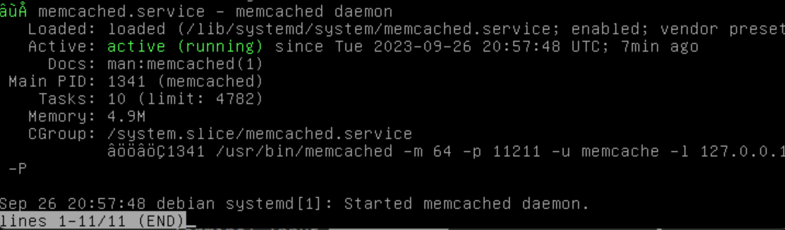
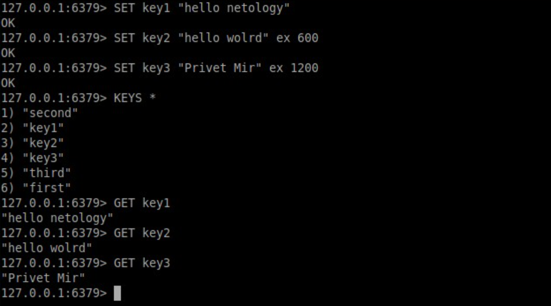
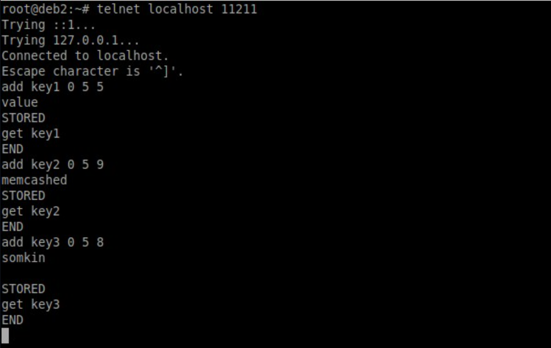
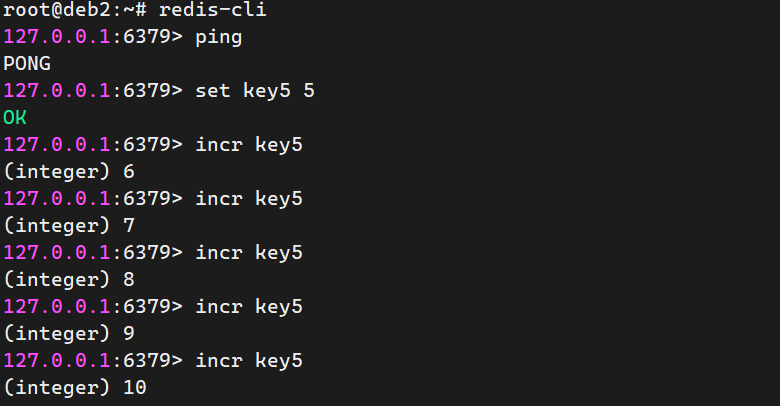

# Домашнее задание к занятию «Кеширование Redis/memcached»

<!--

### Инструкция по выполнению домашнего задания

1. Сделайте fork [репозитория c шаблоном решения](https://github.com/netology-code/sys-pattern-homework) к себе в Github и переименуйте его по названию или номеру занятия, например, https://github.com/имя-вашего-репозитория/gitlab-hw или https://github.com/имя-вашего-репозитория/8-03-hw).
2. Выполните клонирование этого репозитория к себе на ПК с помощью команды `git clone`.
3. Выполните домашнее задание и заполните у себя локально этот файл README.md:
   - впишите вверху название занятия и ваши фамилию и имя;
   - в каждом задании добавьте решение в требуемом виде: текст/код/скриншоты/ссылка;
   - для корректного добавления скриншотов воспользуйтесь инструкцией [«Как вставить скриншот в шаблон с решением»](https://github.com/netology-code/sys-pattern-homework/blob/main/screen-instruction.md);
   - при оформлении используйте возможности языка разметки md. Коротко об этом можно посмотреть в [инструкции по MarkDown](https://github.com/netology-code/sys-pattern-homework/blob/main/md-instruction.md).
4. После завершения работы над домашним заданием сделайте коммит (`git commit -m "comment"`) и отправьте его на Github (`git push origin`).
5. Для проверки домашнего задания преподавателем в личном кабинете прикрепите и отправьте ссылку на решение в виде md-файла в вашем Github.
6. Любые вопросы задавайте в чате учебной группы и/или в разделе «Вопросы по заданию» в личном кабинете.

Желаем успехов в выполнении домашнего задания.

-->

---

### Задание 1. Кеширование 

Приведите примеры проблем, которые может решить кеширование. 

*Приведите ответ в свободной форме.*

- Ускорение доступа к данным: кеширование позволяет хранить копии данных, которые часто запрашиваются, в более быстром хранилище, таком как оперативная память или SSD-диск. Это позволяет ускорить доступ к данным и уменьшить нагрузку на более медленное хранилище, такое как жесткий диск или база данных.

- Снижение нагрузки на сервер: кеширование может снизить количество запросов, отправляемых к серверу, путем хранения ответов на запросы в кеше на клиентской стороне или на прокси-сервере. Это позволяет уменьшить нагрузку на сервер и улучшить производительность системы в целом.

- Сокращение времени загрузки веб-страниц: кеширование может ускорить загрузку веб-страниц, храня копии статических ресурсов, таких как изображения, файлы JavaScript и CSS, на локальном компьютере или на прокси-сервере. Это уменьшает время загрузки страницы и повышает удобство использования веб-сайта.

- Улучшение масштабируемости: кеширование может улучшить масштабируемость системы, позволяя распределять нагрузку между несколькими кешами или копировать кеш на несколько серверов. Это позволяет увеличивать производительность системы при увеличении количества пользователей или объема данных.

- Снижение затрат на вычисления: кеширование может сократить время выполнения вычислительно сложных операций, храня результаты вычислений в кеше. Это может повысить производительность и уменьшить затраты на вычисления.

---

### Задание 2. Memcached

Установите и запустите memcached.

*Приведите скриншот systemctl status memcached, где будет видно, что memcached запущен.*

---

### Задание 3. Удаление по TTL в Memcached

Запишите в memcached несколько ключей с любыми именами и значениями, для которых выставлен TTL 5. 

*Приведите скриншот, на котором видно, что спустя 5 секунд ключи удалились из базы.*

---

### Задание 4. Запись данных в Redis

Запишите в Redis несколько ключей с любыми именами и значениями. 

*Через redis-cli достаньте все записанные ключи и значения из базы, приведите скриншот этой операции.*

## Дополнительные задания (со звёздочкой*)
Эти задания дополнительные, то есть не обязательные к выполнению, и никак не повлияют на получение вами зачёта по этому домашнему заданию. Вы можете их выполнить, если хотите глубже разобраться в материале.

### Задание 5*. Работа с числами 

Запишите в Redis ключ key5 со значением типа "int" равным числу 5. Увеличьте его на 5, чтобы в итоге в значении лежало число 10.  

*INCR / DECR*

_Инкремент / декримент. Значение ключа integer, хотя в базе храниться все равно строка, можно увеличить или уменьшить на 1. Если использовать команду INCR с несуществующем значением то создаться новый ключ со значением 1_

*Приведите скриншот, где будут проделаны все операции и будет видно, что значение key5 стало равно 10.*

