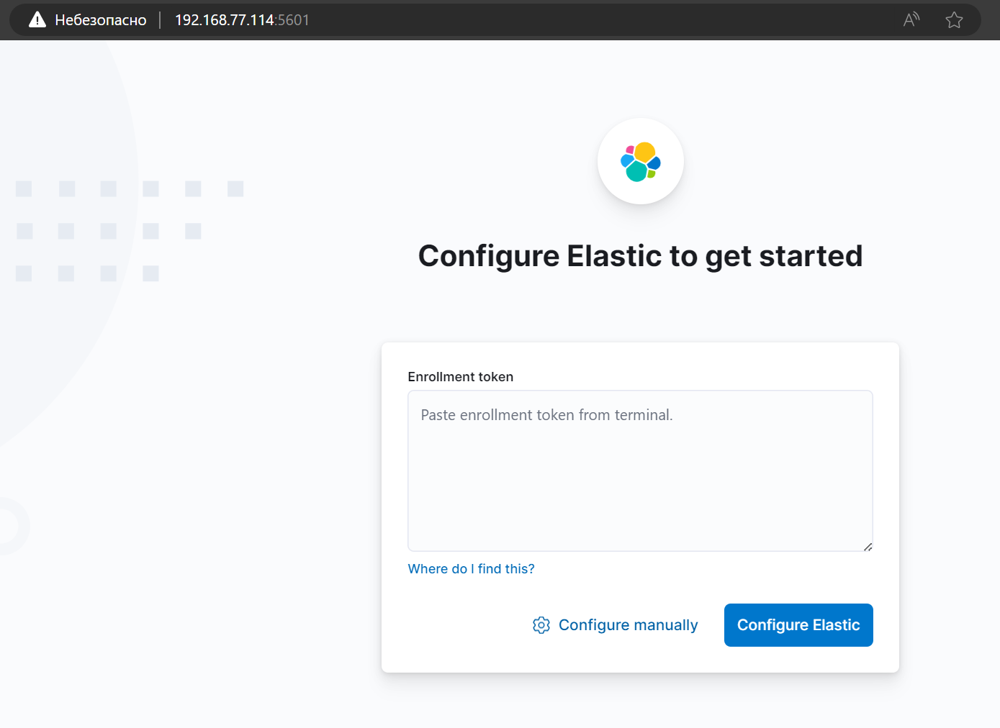

# Домашнее задание к занятию «ELK»

<!--
### Инструкция по выполнению домашнего задания

1. Сделайте fork [репозитория c шаблоном решения](https://github.com/netology-code/sys-pattern-homework) к себе в Github и переименуйте его по названию или номеру занятия, например, https://github.com/имя-вашего-репозитория/gitlab-hw или https://github.com/имя-вашего-репозитория/8-03-hw).
2. Выполните клонирование этого репозитория к себе на ПК с помощью команды `git clone`.
3. Выполните домашнее задание и заполните у себя локально этот файл README.md:
   - впишите вверху название занятия и ваши фамилию и имя;
   - в каждом задании добавьте решение в требуемом виде: текст/код/скриншоты/ссылка;
   - для корректного добавления скриншотов воспользуйтесь инструкцией [«Как вставить скриншот в шаблон с решением»](https://github.com/netology-code/sys-pattern-homework/blob/main/screen-instruction.md);
   - при оформлении используйте возможности языка разметки md. Коротко об этом можно посмотреть в [инструкции по MarkDown](https://github.com/netology-code/sys-pattern-homework/blob/main/md-instruction.md).
4. После завершения работы над домашним заданием сделайте коммит (`git commit -m "comment"`) и отправьте его на Github (`git push origin`).
5. Для проверки домашнего задания преподавателем в личном кабинете прикрепите и отправьте ссылку на решение в виде md-файла в вашем Github.
6. Любые вопросы задавайте в чате учебной группы и/или в разделе «Вопросы по заданию» в личном кабинете.

Желаем успехов в выполнении домашнего задания.
-->

---

## Дополнительные ресурсы

При выполнении задания используйте дополнительные ресурсы:
- [docker-compose elasticsearch + kibana](11-03/docker-compose.yaml);
- [поднимаем elk в docker](https://www.elastic.co/guide/en/elasticsearch/reference/7.17/docker.html);
- [поднимаем elk в docker с filebeat и docker-логами](https://www.sarulabs.com/post/5/2019-08-12/sending-docker-logs-to-elasticsearch-and-kibana-with-filebeat.html);
- [конфигурируем logstash](https://www.elastic.co/guide/en/logstash/7.17/configuration.html);
- [плагины filter для logstash](https://www.elastic.co/guide/en/logstash/current/filter-plugins.html);
- [конфигурируем filebeat](https://www.elastic.co/guide/en/beats/libbeat/5.3/config-file-format.html);
- [привязываем индексы из elastic в kibana](https://www.elastic.co/guide/en/kibana/7.17/index-patterns.html);
- [как просматривать логи в kibana](https://www.elastic.co/guide/en/kibana/current/discover.html);
- [решение ошибки increase vm.max_map_count elasticsearch](https://stackoverflow.com/questions/42889241/how-to-increase-vm-max-map-count).

**Примечание**: если у вас недоступны официальные образы, можете найти альтернативные варианты в DockerHub, например, [такой](https://hub.docker.com/layers/bitnami/elasticsearch/7.17.13/images/sha256-8084adf6fa1cf24368337d7f62292081db721f4f05dcb01561a7c7e66806cc41?context=explore).

### Задание 1. Elasticsearch 

Установите и запустите Elasticsearch, после чего поменяйте параметр cluster_name на случайный. 

*Приведите скриншот команды 'curl -X GET 'localhost:9200/_cluster/health?pretty', сделанной на сервере с установленным Elasticsearch. Где будет виден нестандартный cluster_name*.

<details>
  <summary>

#### Установка Elasticsearch на ВМ с ОС Debian 12

  </summary>

установку производим по шагам инструкции 

[инстукция установки Elasticsearch на Debian 12](./How_to_Install_Elasticsearch_on_Debian_12.md)

</details>

<details>
  <summary>

#### Выполняем задание

  </summary>


Для изменения стандартного имени кластера, вносим изменения в конфигурационный файл

```
nano /etc/elasticsearch/elasticsearch.yml
```

- меняем имя кластера *cluster_name* в секции "Cluster"

```
# ---------------------------------- Cluster -----------------------------------
#
# Use a descriptive name for your cluster:
#
cluster.name: elk.1103
#
```

Для того, чтобы внесенные изменеия применились, перезапускаем службу

```
systemctl restart elasticsearch
```

убеждаемся, что служба работает на порту 9200


Выполняем запрос

```
curl -X GET --cacert /etc/elasticsearch/certs/http_ca.crt -u elastic https://localhost:9200/_cluster/health?pretty
```

Вывод:

```
root@elk:~# curl -X GET --cacert /etc/elasticsearch/certs/http_ca.crt -u elastic https://localhost:9200/_cluster/health?pretty
Enter host password for user 'elastic':
{
  "cluster_name" : "elk.1103",
  "status" : "green",
  "timed_out" : false,
  "number_of_nodes" : 1,
  "number_of_data_nodes" : 1,
  "active_primary_shards" : 1,
  "active_shards" : 1,
  "relocating_shards" : 0,
  "initializing_shards" : 0,
  "unassigned_shards" : 0,
  "delayed_unassigned_shards" : 0,
  "number_of_pending_tasks" : 0,
  "number_of_in_flight_fetch" : 0,
  "task_max_waiting_in_queue_millis" : 0,
  "active_shards_percent_as_number" : 100.0
}
```


</details>

---

### Задание 2. Kibana

Установите и запустите Kibana.

*Приведите скриншот интерфейса Kibana на странице http://<ip вашего сервера>:5601/app/dev_tools#/console, где будет выполнен запрос GET /_cluster/health?pretty*.

<details>
  <summary>

#### Установка Kibana

  </summary> 

Установку Kibana производим аналогично Elasticsearch

```
dpkg -i kibana-8.12.2-amd64.deb
```

```
root@elk:~# dpkg -i kibana-8.12.2-amd64.deb
Выбор ранее не выбранного пакета kibana.
(Чтение базы данных … на данный момент установлено 49987 файлов и каталогов.)
Подготовка к распаковке kibana-8.12.2-amd64.deb …
Распаковывается kibana (8.12.2) …
Настраивается пакет kibana (8.12.2) …
Creating kibana group... OK
Creating kibana user... OK
Kibana is currently running with legacy OpenSSL providers enabled! For details and instructions on how to disable see https://www.elastic.co/guide/en/kibana/8.12/production.html#openssl-legacy-provider
Created Kibana keystore in /etc/kibana/kibana.keystore
```

После установки редактируем конфигурационный файл Kibana

```
nano /etc/kibana/kibana.yml
```
Редактируем параметр host:

```
server.host: 192.168.77.114
```

* данным параметром мы говорим, что сервер должен слушать на интерфейсе 192.168.77.114 *

Разрешаем автозапуск Kibana и перезапускаем ее:

```
systemctl enable kibana
```

```
systemctl restart kibana
```

Открываем браузер и переходим по ссылке http://<ip адрес сервера>:5601.
Мы должны увидеть форму ввода токена.



Переходим на сервер и вводим команду для получения токена:

```
/usr/share/elasticsearch/bin/elasticsearch-create-enrollment-token -s kibana
```

На экране отобразится последовательность из символов — копируем ее и вставляем в Kibana. Кликаем по Configure Elastic:

```
root@elk:~# /usr/share/elasticsearch/bin/elasticsearch-create-enrollment-token -s kibana
eyJ2ZXIiOiI4LjEyLjIiLCJhZHIiOlsiMTkyLjE2OC43Ny4xMTQ6OTIwMCJdLCJmZ3IiOiJmNGU2NGQ4MGQwYjdkYmRkYTkwOGZkMzg5MjlhYjE1OWMyNmM0MGY2OTFjN2M3MjkxNzA0NmQ2ZWVmZDFmMGIxIiwia2V5IjoiTTFyTzM0MEJMWFQ3QjZzR3BtVjk6UWIwQ3lOVl9TRVNRZDhmRTFQOWt2USJ9
```

Откроется окно с вводом проверочного кода. Возвращаемся на сервер и вводим команду:

```
/usr/share/kibana/bin/kibana-verification-code
```


```
root@elk:~# bash /usr/share/kibana/bin/kibana-verification-code
Your verification code is:  628 175
```

Мы получим 6-ти значный код. Вводим его в окне Kibana:


Нажимаем Verify — начнется процесс настройки. После его завершения мы увидим окно ввода логина и пароля.


```
login: elastic
password: был сгенерирован на этапе установки Elasticsearch
``` 


</details>


<details>
  <summary>

#### Выполнение задания

  </summary>

Переходим в раздел DevTools и выполняем запрос GET /_cluster/health?pretty


</details>


---

### Задание 3. Logstash

Установите и запустите Logstash и Nginx. С помощью Logstash отправьте access-лог Nginx в Elasticsearch. 

*Приведите скриншот интерфейса Kibana, на котором видны логи Nginx.*

<details>
  <summary>

#### Установка Logstash

  </summary>

Установка Logstash производится аналогично

```
dpkg -i logstash-8.12.2-amd64.deb
```

Проверяем состояние службы, добавляем в автозапуск и запускаем/перезапускаем службу Logstash

Разрешаем автозапуск:

```
systemctl enable logstash
```
и стартуес сервис:
```
systemctl start logstash
```


#### Настройка Logstash

Настройки для логстэша хранятся в каталоге /etc/logstash/conf.d в файлах формата JSON. Для конфигурации используются следующие секции:

- input (входные данные).
- filter (фильтры).
- output (выходные данные).

</details>

<details>
  <summary>

#### Выполнение задания

  </summary>

_С помощью Logstash отправьте access-лог Nginx в Elasticsearch._

В качестве сервера Nginx будем использовать сервер Angie из задания ["Кластеризация и балансировка нагрузки"](https://github.com/al-zar/sflt/blob/main/2.md#%D0%B7%D0%B0%D0%B4%D0%B0%D0%BD%D0%B8%D0%B5-3)

Настроим приём логов на порту

Для этого создаем файл конфигурации в формате JSON 

```
nano /etc/logstash/conf.d/input.conf
---
input {
  syslog {
    port => 5140
  }
}
```

И настроим передачу логов в наш Elasticsearch

```
nano /etc/logstash/conf.d/output.conf
---
output {
  elasticsearch {
    hosts => ["https://localhost:9200"]
    ssl => true
    ssl_certificate_verification => false
    manage_template => false
    index => "%{[@metadata][beat]}-%{[@metadata][version]}-%{+YYYY.MM.dd}"
    user => elastic
    password => "kIPWJx9cx-_7+Hsu+SuD"
  }
}
```

Проверить конфигурацию можно командой:

```
/usr/share/logstash/bin/logstash --path.settings /etc/logstash -t
```

Мы должны увидеть:

```
...
Configuration OK
```


Перезапускаем сервис logstash:

```
systemctl restart logstash
```

Немного подождем — приложению нужно около 1 минуты, чтобы запуститься. После, введя команду:

```
ss -tulpn | grep 5140
```

... мы увидим что-то на подобие:

```
tcp   LISTEN 0      50                      *:5140            *:*    users:(("java",pid=32585,fd=84))
```


_Сервис запустился и готов принимать логи._

Настроим Nginx, а в нашем случаем - Angie

Откроем конфигурационный файл angie:

```
nano /etc/angie/angie.conf
```

* обратите внимание, для настройки виртуальных доменов может использоваться несколько разных конфигурационных файлов.

Формат логов приводим к виду:

```
  log_format logstash '$remote_addr - $remote_user [$time_local] "$host" '
                      '"$request" $status $body_bytes_sent '
                      '"$http_referer" "$http_user_agent"';
```

А настройку логов приводим к виду:

```
   access_log syslog:server=localhost:5140,tag=angie_access logstash;
   error_log syslog:server=localhost:5140,tag=angie_error notice;
```

* в данном случае мы  отправим логи на сервер localhost (локальный, но если настройка выполняется удаленно, то необходимо указать имя сервера или IP-адрес) и порт 5140, который мы настроили на logstash.

в нашем случае заменим localhost на ip адрес 192.168.77.114

```
   access_log syslog:server=192.168.77.114:5140,tag=angie_access logstash;
   error_log syslog:server=192.168.77.114:5140,tag=angie_error notice;
```

Проверяем корректность конфигурационного файла

```
angie -t
```

Перезапускаем angie:

```
angie -s reload
```


Проверяем логи.


</details>

---

### Задание 4. Filebeat. 

Установите и запустите Filebeat. Переключите поставку логов Nginx с Logstash на Filebeat. 

*Приведите скриншот интерфейса Kibana, на котором видны логи Nginx, которые были отправлены через Filebeat.*


#### Выполнение задания

_Подключил сбор логов с Windows-машины, сервис мобильного приложения ТСД AXELOT для базы ячеистого склада X5_

_на win-машине устанавливается WinLogBeat, настраивается на адрес и порт logstash:5044_

_команды для управления сервисом filebeat в powershell_

полезные команды:
- ```./filebeat -e test config``` - тест конфига 
- ```./filebeat -c filebeat.yml -e``` - запуск в режиме приложения (-e) с указанием конфига (-с)


_запуск сервиса_

```
Start-Service -Name "filebeat"
```

_остановка сервиса_

```
Stop-Service -Name "filebeat"
```

_получение состояния сервиса_ 

```
Get-Service -Name "filebeat"
```

```
Status   Name               DisplayName
------   ----               -----------
Running  filebeat           filebeat
```


## Дополнительные задания (со звёздочкой*)
Эти задания дополнительные, то есть не обязательные к выполнению, и никак не повлияют на получение вами зачёта по этому домашнему заданию. Вы можете их выполнить, если хотите глубже шире разобраться в материале.

### Задание 5*. Доставка данных 

Настройте поставку лога в Elasticsearch через Logstash и Filebeat любого другого сервиса , но не Nginx. 
Для этого лог должен писаться на файловую систему, Logstash должен корректно его распарсить и разложить на поля. 

*Приведите скриншот интерфейса Kibana, на котором будет виден этот лог и напишите лог какого приложения отправляется.*

<!--
GPG ssh
-->
