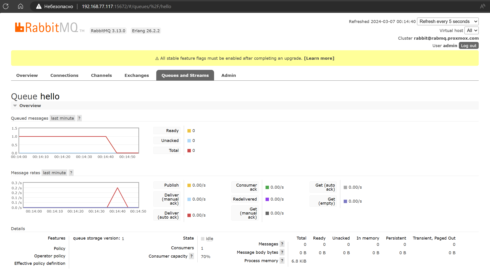

# Домашнее задание к занятию  «Очереди RabbitMQ»

<!--

### Инструкция по выполнению домашнего задания

1. Сделайте fork [репозитория c шаблоном решения](https://github.com/netology-code/sys-pattern-homework) к себе в Github и переименуйте его по названию или номеру занятия, например, https://github.com/имя-вашего-репозитория/gitlab-hw или https://github.com/имя-вашего-репозитория/8-03-hw).
2. Выполните клонирование этого репозитория к себе на ПК с помощью команды `git clone`.
3. Выполните домашнее задание и заполните у себя локально этот файл README.md:
   - впишите вверху название занятия и ваши фамилию и имя;
   - в каждом задании добавьте решение в требуемом виде: текст/код/скриншоты/ссылка;
   - для корректного добавления скриншотов воспользуйтесь инструкцией [«Как вставить скриншот в шаблон с решением»](https://github.com/netology-code/sys-pattern-homework/blob/main/screen-instruction.md);
   - при оформлении используйте возможности языка разметки md. Коротко об этом можно посмотреть в [инструкции по MarkDown](https://github.com/netology-code/sys-pattern-homework/blob/main/md-instruction.md).
4. После завершения работы над домашним заданием сделайте коммит (`git commit -m "comment"`) и отправьте его на Github (`git push origin`).
5. Для проверки домашнего задания преподавателем в личном кабинете прикрепите и отправьте ссылку на решение в виде md-файла в вашем Github.
6. Любые вопросы задавайте в чате учебной группы и/или в разделе «Вопросы по заданию» в личном кабинете.

Желаем успехов в выполнении домашнего задания.

-->

---

### Задание 1. Установка RabbitMQ

Используя Vagrant или VirtualBox, создайте виртуальную машину и установите RabbitMQ.
Добавьте management plug-in и зайдите в веб-интерфейс.

*Итогом выполнения домашнего задания будет приложенный скриншот веб-интерфейса RabbitMQ.*

проверка работы erlang


проверка работы RabbitMQ


веб-интерфейс RabbitMQ


---

### Задание 2. Отправка и получение сообщений

Используя приложенные скрипты, проведите тестовую отправку и получение сообщения.
Для отправки сообщений необходимо запустить скрипт producer.py.

Для работы скриптов вам необходимо установить Python версии 3 и библиотеку Pika.
Также в скриптах нужно указать IP-адрес машины, на которой запущен RabbitMQ, заменив localhost на нужный IP.

```shell script
$ pip install pika
```

Зайдите в веб-интерфейс, найдите очередь под названием hello и сделайте скриншот.
После чего запустите второй скрипт consumer.py и сделайте скриншот результата выполнения скрипта

*В качестве решения домашнего задания приложите оба скриншота, сделанных на этапе выполнения.*

Для закрепления материала можете попробовать модифицировать скрипты, чтобы поменять название очереди и отправляемое сообщение.




---

### Задание 3. Подготовка HA кластера

Используя Vagrant или VirtualBox, создайте вторую виртуальную машину и установите RabbitMQ.
Добавьте в файл hosts название и IP-адрес каждой машины, чтобы машины могли видеть друг друга по имени.

 Cодержимое hosts файла:
```shell script
$ cat /etc/hosts
192.168.77.117 rabmq1
192.168.77.121 rabmq2
```

После этого ваши машины могут пинговаться по имени.

Затем объедините две машины в кластер и создайте политику ha-all на все очереди.

*В качестве решения домашнего задания приложите скриншоты из веб-интерфейса с информацией о доступных нодах в кластере и включённой политикой.*

Также приложите вывод команды с двух нод:

```shell script
$ rabbitmqctl cluster_status
```


_веб интерфейс 1 ноды_


_веб интерфейс 2 ноды_


Для закрепления материала снова запустите скрипт producer.py и приложите скриншот выполнения команды на каждой из нод:

```shell script
$ rabbitmqadmin get queue='hello'
```

устанавливаем rabbitmqadmin:

1. скачиваем скрипт

```
wget https://raw.githubusercontent.com/rabbitmq/rabbitmq-management/v3.7.8/bin/rabbitmqadmin
```

2. меняем права на скаченный скрипт

```
chmod 777 rabbitmqadmin
```

3. меняем версию python в скрипте

```
#!/usr/bin/env python3
```

Теперь можно выполнять команды ниже:

  - Чтобы получить список очередей,

```
./rabbitmqadmin -f tsv -q list queues
```

  - Чтобы удалить запросы,

```
./rabbitmqadmin delete queue name=name_of_queue
```

  - Добавление привязки между exchange и queue

```
./rabbitmqadmin declare binding source="exchangename" destination_type="queue" destination="queuename" routing_key="routingkey"
```

выполнение задания на 1 ноде

```
root@rabmq1:~# ./rabbitmqadmin get queue='hello'
+-------------+----------+---------------+-----------------+---------------+------------------+------------+-------------+
| routing_key | exchange | message_count |     payload     | payload_bytes | payload_encoding | properties | redelivered |
+-------------+----------+---------------+-----------------+---------------+------------------+------------+-------------+
| hello       |          | 21            | Hello Netology! | 15            | string           |            | True        |
+-------------+----------+---------------+-----------------+---------------+------------------+------------+-------------+
```


выполнение задания на 2 ноде

```
root@rabmq2:~# ./rabbitmqadmin get queue='hello'
+-------------+----------+---------------+-----------------+---------------+------------------+------------+-------------+
| routing_key | exchange | message_count |     payload     | payload_bytes | payload_encoding | properties | redelivered |
+-------------+----------+---------------+-----------------+---------------+------------------+------------+-------------+
| hello       |          | 21            | Hello Netology! | 15            | string           |            | True        |
+-------------+----------+---------------+-----------------+---------------+------------------+------------+-------------+
```


После чего попробуйте отключить одну из нод, желательно ту, к которой подключались из скрипта, затем поправьте параметры подключения в скрипте consumer.py на вторую ноду и запустите его.

*Приложите скриншот результата работы второго скрипта.*

модифицированный скрипт:

```
root@rabmq3:~# cat re-consumer.py
#!/usr/bin/env python
# coding=utf-8
import pika

# remote connection
credentials = pika.PlainCredentials('admin', 'Zaq1Xsw2')  #Auth
parameters = pika.ConnectionParameters('192.168.77.121', credentials=credentials)
connection = pika.BlockingConnection(parameters)

channel = connection.channel()
channel.queue_declare(queue='hello')


def callback(ch, method, properties, body):
    print(" [x] Received %r" % body)

channel.basic_consume(queue='hello',
                     # auto_ack=True,
                      on_message_callback=callback,
                      auto_ack=False,)


channel.start_consuming()

```


## Дополнительные задания (со звёздочкой*)
Эти задания дополнительные, то есть не обязательные к выполнению, и никак не повлияют на получение вами зачёта по этому домашнему заданию. Вы можете их выполнить, если хотите глубже шире разобраться в материале.

### * Задание 4. Ansible playbook

Напишите плейбук, который будет производить установку RabbitMQ на любое количество нод и объединять их в кластер.
При этом будет автоматически создавать политику ha-all.

*Готовый плейбук разместите в своём репозитории.*

