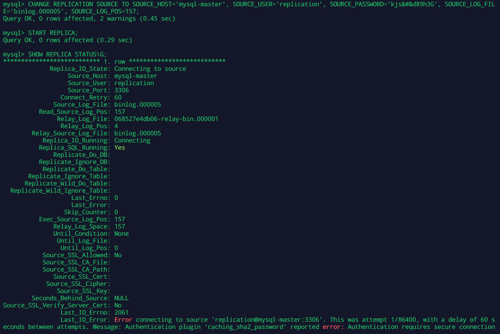
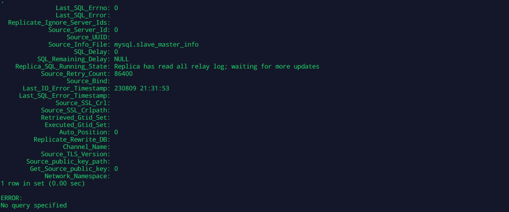

# Домашнее задание к занятию «Репликация и масштабирование. Часть 1»
<!--
### Инструкция по выполнению домашнего задания

1. Сделайте fork [репозитория c шаблоном решения](https://github.com/netology-code/sys-pattern-homework) к себе в Github и переименуйте его по названию или номеру занятия, например, https://github.com/имя-вашего-репозитория/gitlab-hw или https://github.com/имя-вашего-репозитория/8-03-hw).
2. Выполните клонирование этого репозитория к себе на ПК с помощью команды `git clone`.
3. Выполните домашнее задание и заполните у себя локально этот файл README.md:
   - впишите вверху название занятия и ваши фамилию и имя;
   - в каждом задании добавьте решение в требуемом виде: текст/код/скриншоты/ссылка;
   - для корректного добавления скриншотов воспользуйтесь инструкцией [«Как вставить скриншот в шаблон с решением»](https://github.com/netology-code/sys-pattern-homework/blob/main/screen-instruction.md);
   - при оформлении используйте возможности языка разметки md. Коротко об этом можно посмотреть в [инструкции по MarkDown](https://github.com/netology-code/sys-pattern-homework/blob/main/md-instruction.md).
4. После завершения работы над домашним заданием сделайте коммит (`git commit -m "comment"`) и отправьте его на Github (`git push origin`).
5. Для проверки домашнего задания преподавателем в личном кабинете прикрепите и отправьте ссылку на решение в виде md-файла в вашем Github.
6. Любые вопросы задавайте в чате учебной группы и/или в разделе «Вопросы по заданию» в личном кабинете.

Желаем успехов в выполнении домашнего задания.
-->
---
<details>
  <summary>

### Задание 1

На лекции рассматривались режимы репликации master-slave, master-master, опишите их различия.

*Ответить в свободной форме.*

  </summary>

Репликация (от лат. replico -повторяю) — это тиражирование изменений данных с главного сервера БД на одном или нескольких зависимых серверах. Главный сервер будем называть мастером, а зависимые — репликами.
Изменения данных, происходящие на мастере, повторяются на репликах (но не наоборот). Поэтому запросы на изменение данных (INSERT, UPDATE, DELETE и т. д.) выполняются только на мастере, а запросы на чтение данных (проще говоря, SELECT) могут выполняться как на репликах, так и на мастере. Процесс репликации на одной из реплик не влияет на работу других реплик, и практически не влияет на работу мастера.

*master-slave*

Классическая схема репликации, когда данные с одного сервера "master - ведущий" передаются на "slave - ведомый", при этом запись данных производится только на master'е, а чтение возможно как с 'master', так и с 'slave'. серверов 'slave' может быть несколько.

*master-master*

Схема репликации, когда данные передаются с одного master сервера на другой(-ие) master сервер. Запись данных в БД может производиться на любом сервере master, НО при сбое репликации данные с большей долей вероятности станут не консистентными. С данной схеме репликации может быть несколько серверов 'master' и к каждому можно добавить один или несколько серверов 'slave'.

</details>
---

<details>
  <summary>

### Задание 2

Выполните конфигурацию master-slave репликации, примером можно пользоваться из лекции.

*Приложите скриншоты конфигурации, выполнения работы: состояния и режимы работы серверов.*

  </summary>

Конфигурацию репликации master-slave будем выполнять на docker-контейнерах

[docker-compose файл](https://github.com/al-zar/sdb-mysql-replication/blob/main/docker-compose.yml) 

```
dbm - mysql-master server

dbs - mysql-slave server
```

#### Настройка mysql-master сервера.

Будем начинать с настройки конфигурационного файла базы данных.

```
$. nano my.cnf 
```

Первый делом нам нужно настроить server_id. (_ 'server_id' это идентификатор сервера и он используется для идентификации сервера в топологии репликации и он обязательно должен быть положительным целым числом от 1 до 32_).

```
[mysqld]
server_id = 10
```

Настройка ведение двоичного журнала (binary log).

_Ведения двоичного журнала на сервере master является обязательным действием потому что сервер slave будет подключаться на сервер master и читать эти двоичные журналы. Ведение двоичного журнала по умолчанию включено. Но по умолчанию все двоичные журналы будут создаваться и хранится в директории там где лежат все файлы базы данных. Нам это не подходит и мы сами укажем место хранения двоичных журналов._

```
[mysqld]
...
log_bin = /app/mysql/binary_log/mysql-bin.log
log_bin_index = /app/mysql/binary_log/binlog.index
```

Настройка согласованности репликации.

_За согласованность репликации отвечает переменная innodb_flush_log_at_trx_commit и sync_binlog. Всегда ставьте значения этих переменных в значения 1. Данная переменная может иметь значения 0, 1, 2. Если вы укажите 0 или 2, то есть риск потерять транзакции._

```
[mysqld]
...
innodb_flush_log_at_trx_commit = 1
sync_binlog = 1
```

Настройка на реплике ведения двоичного журнала.

_Ведения двоичного журнала на сервере slave является не обязательным, ну так как в определенный момент вы захотите переключить репликацию в обратную сторону то лучше чтобы slave сервер тоже вел свой двоичный журнал._

```
[mysqld]
...
log_replica_updates = ON
```

Настройка ведения журнала ретрансляции.

_За ведения журнала ретрансляции отвечают переменные relay_log и relay_log_index. Эти переменные относятся к серверу slave, и они по умолчанию включены, но они будут создаваться в директории где у вас лежат все файлы базы данных, и нам это не подходит. Мы создадим свои директории._

```
[mysqld]
...
relay_log = /app/mysql/relay_log/mysql-relay.log
relay_log_index = /app/mysql/relay_log/mysql-relay.index
```

Результат.

В итоги получим конфигурационный файл для сервера mysql-master [my.cnf](https://github.com/al-zar/sdb-mysql-replication/blob/main/dbdata/10/my.cnf)

```
[mysqld]
server_id = 10
log_bin = /app/mysql/binary_log/mysql-bin.log
log_bin_index = /app/mysql/binary_log/binlog.index
innodb_flush_log_at_trx_commit = 1
sync_binlog = 1
log_replica_updates = ON
relay_log = /app/mysql/relay_log/mysql-relay.log
relay_log_index = /app/mysql/relay_log/mysql-relay.index
```

#### Создания учетной записи на master сервере.

_Каждый slave сервер будет подключаться к master серверу с использованием имени пользователя и пароля, поэтому на master сервере должна быть учетная запись пользователя, которую slave сервер будет использовать для подключения._

Создаем учетную запись на mysql-master сервере.

подключение к docker-image

```
docker exec -it mysql-master bash

bash-4.4# mysql

mysql> CREATE USER 'replication'@'%' IDENTIFIED BY 'kjs&#&d89h3G';
```

Назначаем этому пользователю необходимые права.

```
mysql> GRANT REPLICATION SLAVE ON *.* TO 'replication'@'%';
```
 
Настройка slave сервера.

_В конфигурационный файл slave сервера мы должны добавить все что мы добавляли на master сервер, но за исключением server_id. server_id должен быть уникальный на каждом сервере в той топологии репликации где он участвует. Ну и добавим параметр read_only чтобы не было возможности делать операции вставки, редактирования и удаления данных, а только их чтения._

[my.cnf](https://github.com/al-zar/sdb-mysql-replication/blob/main/dbdata/11/my.cnf)

```
[mysqld]
server_id = 11
log_bin = /app/mysql/binary_log/mysql-bin.log
log_bin_index = /app/mysql/binary_log/binlog.index
innodb_flush_log_at_trx_commit = 1
sync_binlog = 1
log_replica_updates = ON
relay_log = /app/mysql/relay_log/mysql-relay.log
relay_log_index = /app/mysql/relay_log/mysql-relay.index
read_only = ON
```
 
На master сервере server_id у нас 10, а slave сервер будет 11.

#### Резервная копия mysql-master сервера.

_Настала очередь сделать резервную копию базы данных master сервера и перенести эту копию на slave сервер. Сделать резервную копию есть множество вариантов, но мы будем использовать самый простой, утилита mysqldump._

```
$. mysqldump -u root -p --all-databases --source-data > /tmp/backup.db
```

_После того как мы сделали резервную копию базы данных, нам нужно её перенести на mysql-slave сервер, и на mysql-slave сервере нужно эту резервную копию импортировать._

```
$. mysql -u root -p < /tmp/backup.db
```

Поиск позиции двоичного журнала на mysql-master сервере.

_На master сервере нам нужно найти последнюю позицию в двоичном журнале, та и сам журнал как называется на текущий момент._

```
mysql> SHOW MASTER STATUS;
+---------------+----------+--------------+------------------+-------------------+
| File          | Position | Binlog_Do_DB | Binlog_Ignore_DB | Executed_Gtid_Set |
+---------------+----------+--------------+------------------+-------------------+
| binlog.000005 |      157 |              |                  |                   |
+---------------+----------+--------------+------------------+-------------------+
```

В этом результате нам важно записать значения File и Position.

Подключаем mysql-slave сервер к mysql-master серверу.

```
mysql> CHANGE REPLICATION SOURCE TO SOURCE_HOST='mysql-master', SOURCE_USER='replication', SOURCE_PASSWORD='kjs&#&d89h3G', SOURCE_LOG_FILE='binlog.000005', SOURCE_LOG_POS=157;
```

Запуск репликации.

_Для включения и остановки репликации в базе данных существуют команды **START REPLICA** и **STOP REPLICA**._

```
mysql> START REPLICA;
```

Проверка репликации.

_После запуска репликации нам нужно проверить правильно ли все работает. Для проверки на mysql-slave сервере воспользуемся командой:_

```
mysql> SHOW REPLICA STATUS\G;
```




Самые важные параметры которые показывают что репликация проходит успешно это:

```
          Replica_IO_Running: Connecting
          Replica_SQL_Running: Yes
```

проект можно скачать с github

```
git clone git@github.com:al-zar/sdb-mysql-replication.git

```

перейти в каталог

```
cd sdb-mysql-replication/
```

и запустить docker-compose (docker-compose должен быть установлен предварительно)

```
docker-compose up -d
```

</details>

---

## Дополнительные задания (со звёздочкой*)
Эти задания дополнительные, то есть не обязательные к выполнению, и никак не повлияют на получение вами зачёта по этому домашнему заданию. Вы можете их выполнить, если хотите глубже шире разобраться в материале.

---

### Задание 3* 

Выполните конфигурацию master-master репликации. Произведите проверку.

*Приложите скриншоты конфигурации, выполнения работы: состояния и режимы работы серверов.*
