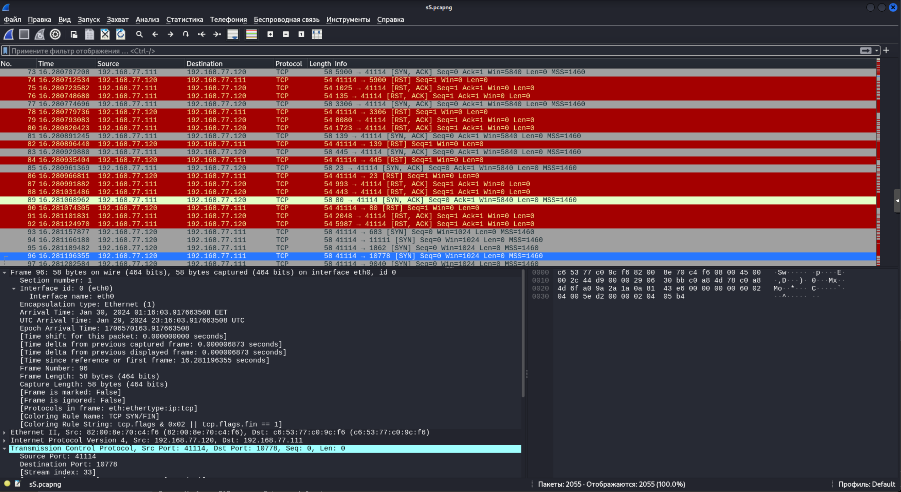
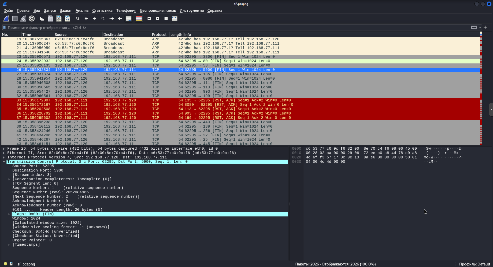
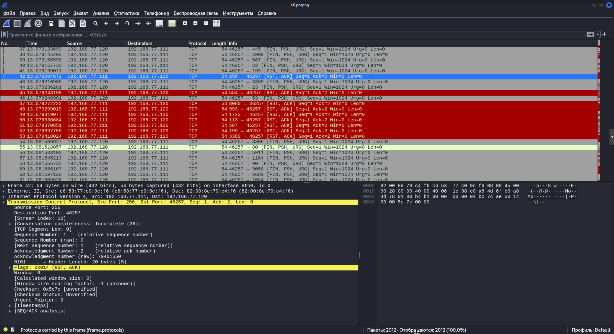
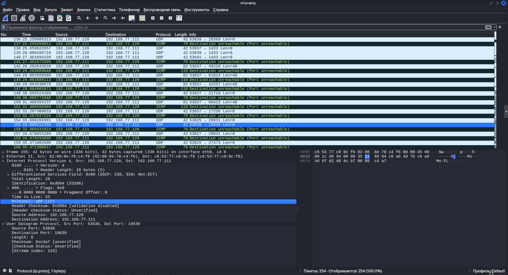

# Домашнее задание к занятию «Уязвимости и атаки на информационные системы»

<!--

### Инструкция по выполнению домашнего задания

1. Сделайте fork [репозитория c шаблоном решения](https://github.com/netology-code/sys-pattern-homework) к себе в Github и переименуйте его по названию или номеру занятия, например, https://github.com/имя-вашего-репозитория/gitlab-hw или https://github.com/имя-вашего-репозитория/8-03-hw).
2. Выполните клонирование этого репозитория к себе на ПК с помощью команды `git clone`.
3. Выполните домашнее задание и заполните у себя локально этот файл README.md:
   - впишите вверху название занятия и ваши фамилию и имя;
   - в каждом задании добавьте решение в требуемом виде: текст/код/скриншоты/ссылка;
   - для корректного добавления скриншотов воспользуйтесь инструкцией [«Как вставить скриншот в шаблон с решением»](https://github.com/netology-code/sys-pattern-homework/blob/main/screen-instruction.md);
   - при оформлении используйте возможности языка разметки md. Коротко об этом можно посмотреть в [инструкции по MarkDown](https://github.com/netology-code/sys-pattern-homework/blob/main/md-instruction.md).
4. После завершения работы над домашним заданием сделайте коммит (`git commit -m "comment"`) и отправьте его на Github (`git push origin`).
5. Для проверки домашнего задания преподавателем в личном кабинете прикрепите и отправьте ссылку на решение в виде md-файла в вашем Github.
6. Любые вопросы задавайте в чате учебной группы и/или в разделе «Вопросы по заданию» в личном кабинете.

Желаем успехов в выполнении домашнего задания.
-->
------

### Задание 1

Скачайте и установите виртуальную машину Metasploitable: https://sourceforge.net/projects/metasploitable/.

Это типовая ОС для экспериментов в области информационной безопасности, с которой следует начать при анализе уязвимостей.

Просканируйте эту виртуальную машину, используя **nmap**.

Попробуйте найти уязвимости, которым подвержена эта виртуальная машина.

Сами уязвимости можно поискать на сайте https://www.exploit-db.com/.

Для этого нужно в поиске ввести название сетевой службы, обнаруженной на атакуемой машине, и выбрать подходящие по версии уязвимости.

Ответьте на следующие вопросы:

- Какие сетевые службы в ней разрешены?
- Какие уязвимости были вами обнаружены? (список со ссылками: достаточно трёх уязвимостей)

*Приведите ответ в свободной форме.*  

Стенд:

ВМ Metasploitable, ip 192.168.77.111

ВМ Kali-Linux, ip 192.168.77.120

На стенде "подопытным" образцом будет ВМ с ОС Metasploitable.

Сканирование будем производить с ВМ Kali-Linux 

Просканируем машину утилитой **nmap** с ключом **-sV**, чтобы узнать о запущенных на ней сервисах 

Утилита подключается поочередно к каждому порту и определяет доступную информацию:

`sudo nmap -sV 192.168.77.111`

Результат сканирования:

```
┌──(root㉿kali)-[~]
└─# nmap -sV 192.168.77.111                                           
Starting Nmap 7.94SVN ( https://nmap.org ) at 2024-01-30 01:11 EET
Nmap scan report for 192.168.77.111
Host is up (0.00048s latency).                                               
Not shown: 977 closed tcp ports (reset)                                      
PORT     STATE SERVICE      VERSION                                          
21/tcp   open  ftp          vsftpd 2.3.4                                     
22/tcp   open  ssh          OpenSSH 4.7p1 Debian 8ubuntu1 (protocol 2.0)     
23/tcp   open  telnet?                                                       
25/tcp   open  smtp?                                                         
53/tcp   open  domain       ISC BIND 9.4.2                                   
80/tcp   open  http         Apache httpd 2.2.8 ((Ubuntu) DAV/2)              
111/tcp  open  rpcbind      2 (RPC #100000)                                  
139/tcp  open  netbios-ssn  Samba smbd 3.X - 4.X (workgroup: WORKGROUP)      
445/tcp  open  netbios-ssn  Samba smbd 3.X - 4.X (workgroup: WORKGROUP)      
512/tcp  open  exec?                                                         
513/tcp  open  login?                                                        
514/tcp  open  shell?                                                        
1099/tcp open  java-rmi     GNU Classpath grmiregistry                       
1524/tcp open  bindshell    Metasploitable root shell                        
2049/tcp open  nfs          2-4 (RPC #100003)                                
2121/tcp open  ccproxy-ftp?
3306/tcp open  mysql?
5432/tcp open  postgresql   PostgreSQL DB 8.3.0 - 8.3.7
5900/tcp open  vnc          VNC (protocol 3.3)
6000/tcp open  X11          (access denied)
6667/tcp open  irc          UnrealIRCd
8009/tcp open  ajp13        Apache Jserv (Protocol v1.3)
8180/tcp open  http         Apache Tomcat/Coyote JSP engine 1.1
MAC Address: C6:53:77:C0:9C:F6 (Unknown)
Service Info: Host: irc.Metasploitable.LAN; OSs: Unix, Linux; CPE: cpe:/o:linux:linux_kernel

Service detection performed. Please report any incorrect results at https://nmap.org/submit/ .
Nmap done: 1 IP address (1 host up) scanned in 193.29 seconds
```


Утилита **nmap** поддерживает использование дополнительных, подключаемых скриптов.

На сайте https://vulners.com/ (База данных уязвимостей и поисковая система) есть скрипт NSE  - **nmap_vulners**  для **nmap**.
Скрипт NSE использует информацию об известных сервисах для предоставления данных об уязвимостях. 

[скрипт nmap_vulners](https://vulners.com/plugins#offensive)

Установка:
```
sudo cp ~/Downloads/vulners.nse /usr/share/nmap/scripts/
sudo nmap --script-updatedb
```
Запуск:
```
sudo nmap -sV --script vulners 192.168.77.111
```

Лог получается довольно таки обширным, но уже с описанием уязвимостей сканируемого хоста

[nmap -sV --script vulners 192.168.77.111 > nmap--Metasploitable.log](./nmap--Metasploitable.log)


---

Выберем 3 различные уязвимости из всего списка:

1) **порт 53/TCP (ISC BIND 9.4.2)**  [CVE-2014-8500](https://vulners.com/search?query=CVE-2014-8500)

описание уязвимости (перевод):

>> ISC BIND с 9.0.x по 9.8.x, с 9.9.0 по 9.9.6 и с 9.10.0 по 9.10.1 не ограничивает цепочку делегирования, что позволяет удаленным злоумышленникам вызывать отказ в обслуживании (потребление памяти и именованный сбой) с помощью большого или бесконечного числа обращений.

2) **порт 22/TCP (OpenSSH 4.7p1)**  [CVE-2010-4478](https://vulners.com/search?query=CVE-2010-4478) 

описание уязвимости (перевод):

>> OpenSSH 5.6 и более ранних версий, когда включен J-PAKE, неправильно проверяет общедоступные параметры в протоколе J-PAKE, что позволяет удаленным злоумышленникам обходить необходимость в знании общего секрета и успешно проходить аутентификацию, отправляя обработанные значения в каждом раунде протокола, что связано с проблемой, связанной с CVE-2010-4252.

3) **порт 80/TCP (Apache http_server 2.2.8)**  [CVE-2017-7679](https://vulners.com/cve/CVE-2017-7679)

описание уязвимости (перевод):

>> В Apache httpd 2.2.x до версии 2.2.33 и 2.4.x до версии 2.4.26 mod_mime может считывать один байт после конца буфера при отправке заголовка ответа вредоносного типа содержимого.

---


### Задание 2

Проведите сканирование Metasploitable в режимах SYN, FIN, Xmas, UDP.

Запишите сеансы сканирования в Wireshark.

Ответьте на следующие вопросы:

- Чем отличаются эти режимы сканирования с точки зрения сетевого трафика?
- Как отвечает сервер?

*Приведите ответ в свободной форме.*


---

**Выполнение задания 2.**

*Wireshark - сетевой анализатор, для анализа трафика проходящего через сетевой интерфейс.*

Установка: `sudo apt install wireshark`. Воспользуемся уже установленным в **Kalilinux**. Проведём сканирование сети и запишем сессию.


- По умолчанию Nmap осуществляет SYN сканирование. `nmap -sS` (TCP SYN сканирование), этот тип использует только пакеты SYN для определения того, открыт ли порт. 
Этот тип сканирования заменяет сканирование с использованием соединения для пользователей не имеющих достаточных привилегий.

Отсылается SYN пакет. При получении ответы SYN/ACK указывают на то, что порт прослушивается (открыт). RST (сброс) указывает на то, что порт не прослушивается.


```
sudo nmap -sS 192.168.77.111 
```

 Дамп Wireshark: [ nmap -sS .pcapng](./sS.pcapng)




- Для режима FIN  используется флаг `-sF` в этом режиме Nmap отправляет TCP FIN пакеты на целевые порты, если порт закрыт, устройство отправляет обратно RST пакет, а если порт открыт, то никакого ответа не будет получено. FIN-сканирование используется для определения открытых портов без вызова создания логов на атакуемом устройстве.

Из документации на работу в режиме сканирования FIN следует:  любой пакет, не содержащий установленного бита SYN, RST или ACK, повлечет за собой отправку RST в ответ в случае, если порт закрыт, или не повлечет никакого ответа, если порт открыт.  Т.к. ни один из этих битов не установлен, то любая комбинация трех оставшихся (FIN, PSH и URG) будет являться правильной.


```
sudo nmap -sF 192.168.77.111 
```

 Дамп Wireshark: [ nmap -sF .pcapng](./wshr-sF.pcapng)




- Для режима Xmas  используется флаг `-sX` . В Xmas-сканировании Nmap отправляет пакеты, устанавливающие состояние URG, PUSH и FIN для определенных портов. Если порт закрыт, устройство отправляет RST пакет в ответ, а если порт открыт, то никакого ответа не будет получено. 


```
sudo nmap -sX 192.168.77.111
```

 Дамп Wireshark: [ nmap -sX .pcapng](./wshr-sX.pcapng)




- Для режима UDP  используется флаг `-sU`, он используется для сканирования UDP-портов на устройствах.
 Nmap будет отправлять UDP-пакеты на указанные порты и анализировать полученные ответы. Открытый порт считается доступным, закрытый - недоступным, а если ответ не получен, порт считается фильтрованным (filtered).
 

```
sudo nmap -sU 192.168.77.111 
``` 
 
При сканировании **Metasploitable** обнаружено:
```
PORT     STATE         SERVICE
53/udp   open          domain
68/udp   open|filtered dhcpc
69/udp   open|filtered tftp
111/udp  open          rpcbind
137/udp  open          netbios-ns
138/udp  open|filtered netbios-dgm
2049/udp open          nfs
```


Из документации на режим работы в UDP следует: UDP сканирование работает путем посылки пустого (без данных) UDP заголовка на каждый целевой порт. Если в ответ приходит ICMP ошибка о недостижимости порта (тип 3, код 3), значит порт закрыт. Другие ICMP ошибки недостижимости (тип 3, коды 1, 2, 9, 10 или 13) указывают на то, что порт фильтруется. Иногда, служба будет отвечать UDP пакетом, указывая на то, что порт открыт. Если после нескольких попыток не было получено никакого ответа, то порт классифицируется как `открыт|фильтруется`. Это означает, что порт может быть открыт, или, возможно, пакетный фильтр блокирует его.


 Дамп Wireshark: [ nmap -sU .pcapng](./wshr-sU.pcapng)


