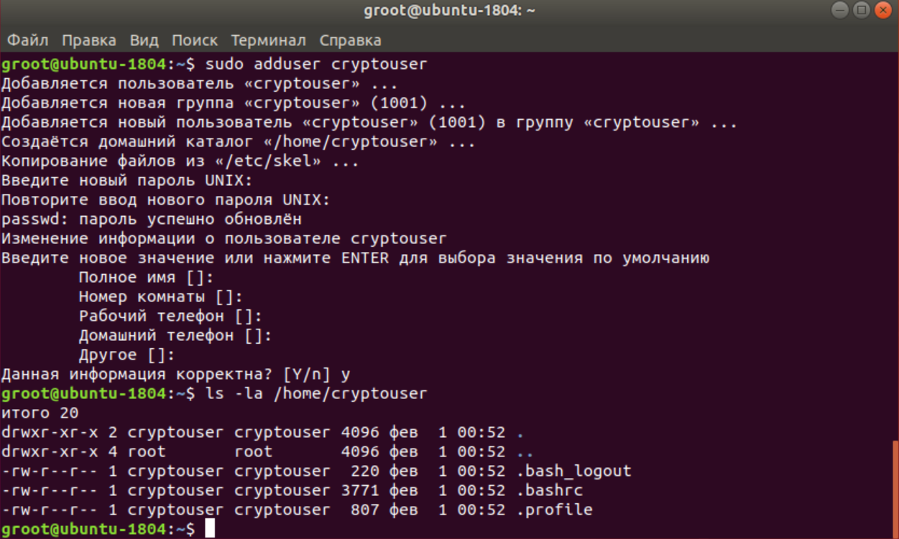
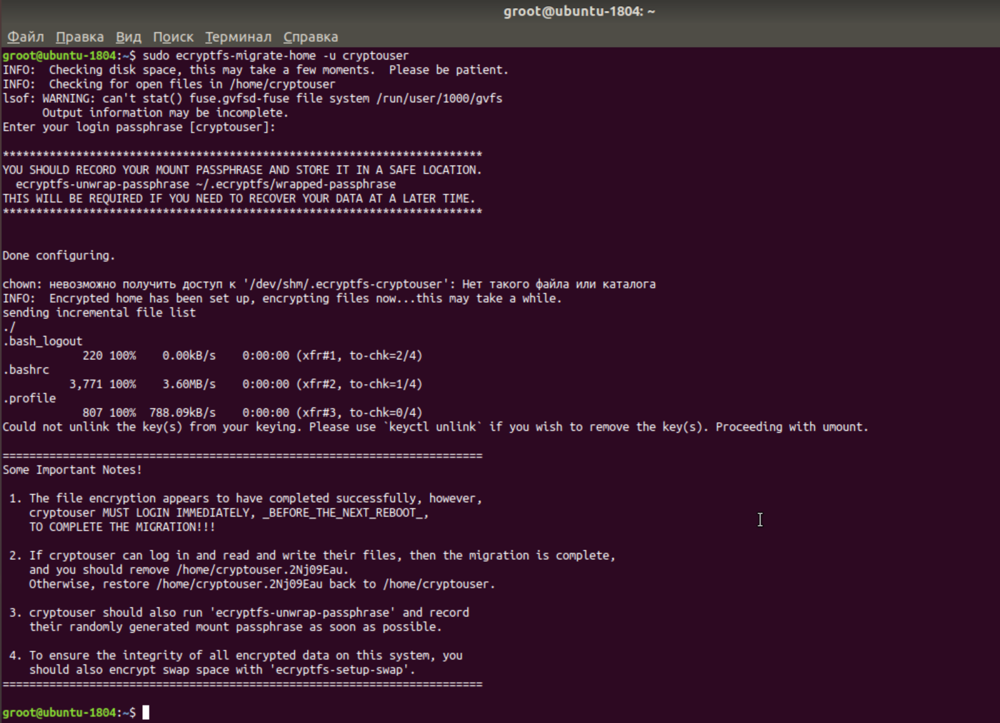
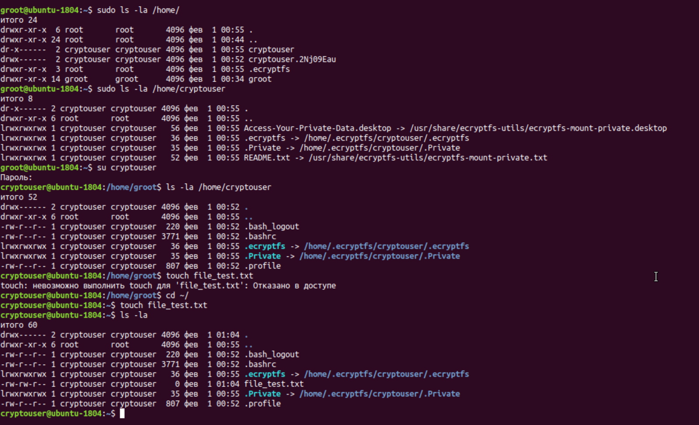
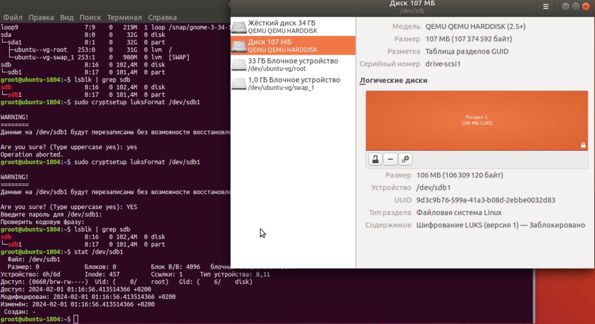
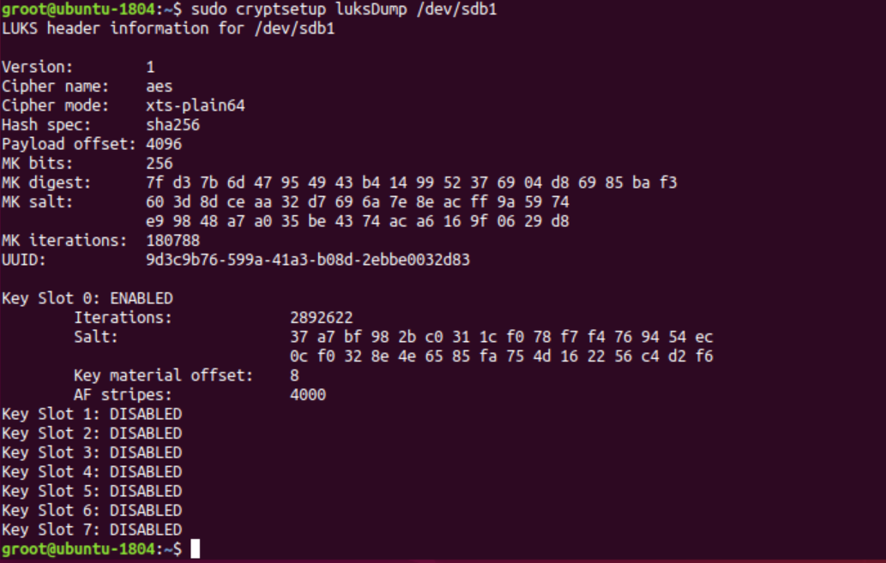
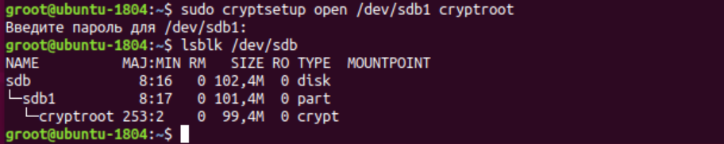
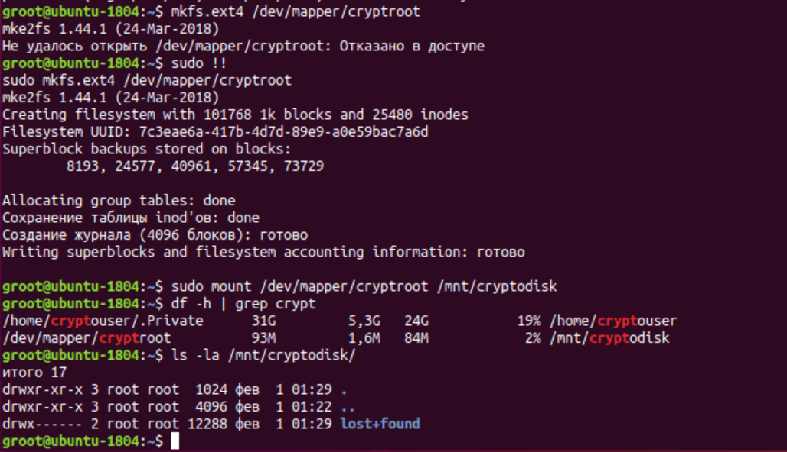

# Домашнее задание к занятию  «Защита хоста»

<!--

### Инструкция по выполнению домашнего задания

1. Сделайте fork [репозитория c шаблоном решения](https://github.com/netology-code/sys-pattern-homework) к себе в Github и переименуйте его по названию или номеру занятия, например, https://github.com/имя-вашего-репозитория/gitlab-hw или https://github.com/имя-вашего-репозитория/8-03-hw).
2. Выполните клонирование этого репозитория к себе на ПК с помощью команды `git clone`.
3. Выполните домашнее задание и заполните у себя локально этот файл README.md:
   - впишите вверху название занятия и ваши фамилию и имя;
   - в каждом задании добавьте решение в требуемом виде: текст/код/скриншоты/ссылка;
   - для корректного добавления скриншотов воспользуйтесь инструкцией [«Как вставить скриншот в шаблон с решением»](https://github.com/netology-code/sys-pattern-homework/blob/main/screen-instruction.md);
   - при оформлении используйте возможности языка разметки md. Коротко об этом можно посмотреть в [инструкции по MarkDown](https://github.com/netology-code/sys-pattern-homework/blob/main/md-instruction.md).
4. После завершения работы над домашним заданием сделайте коммит (`git commit -m "comment"`) и отправьте его на Github (`git push origin`).
5. Для проверки домашнего задания преподавателем в личном кабинете прикрепите и отправьте ссылку на решение в виде md-файла в вашем Github.
6. Любые вопросы задавайте в чате учебной группы и/или в разделе «Вопросы по заданию» в личном кабинете.

Желаем успехов в выполнении домашнего задания.

-->

------

### Задание 1

1. Установите **eCryptfs**.
2. Добавьте пользователя cryptouser.
3. Зашифруйте домашний каталог пользователя с помощью eCryptfs.


*В качестве ответа  пришлите снимки экрана домашнего каталога пользователя с исходными и зашифрованными данными.*  

---

**Выполнение задания 1.**

Установка **eCryptfs**.
```bash
sudo apt install ecryptfs-utils
```

Добавим пользователя cryptouser

```
sudo adduser cryptouser
```




useradd -m -G root user


---
*можно создать пользователя и сразу же зашифровать домашнюю директорию*
 
```bash
sudo adduser --encrypt-home cryptouser
```
---

Шифрование домашнего каталога пользователя

```bash
$ sudo ecryptfs-migrate-home -u cryptouser

INFO:  Checking disk space, this may take a few moments.  Please be patient.
INFO:  Checking for open files in /home/cryptouser
Enter your login passphrase [cryptouser]:
```






### Задание 2

1. Установите поддержку **LUKS**.
2. Создайте небольшой раздел, например, 100 Мб.
3. Зашифруйте созданный раздел с помощью LUKS.

*В качестве ответа пришлите снимки экрана с поэтапным выполнением задания.*


##Установка LUKS


```
sudo apt-get install cryptsetup
 
```


добавляем диск к виртуальной машине на гипервизоре (sdb)

размечаем  раздел диска на 100 Мб 

Зашифруем созданый раздел 

` sudo cryptsetup luksFormat /dev/sdb1 `




Информация о зашифрованном разделе:



---

в терминале можно зашифрованый раздел примонтировать:







## Дополнительные задания (со звёздочкой*)

Эти задания дополнительные, то есть не обязательные к выполнению, и никак не повлияют на получение вами зачёта по этому домашнему заданию. Вы можете их выполнить, если хотите глубже шире разобраться в материале

### Задание 3 *

1. Установите **apparmor**.
2. Повторите эксперимент, указанный в лекции.
3. Отключите (удалите) apparmor.


*В качестве ответа пришлите снимки экрана с поэтапным выполнением задания.*


