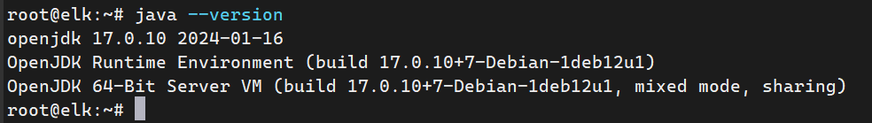
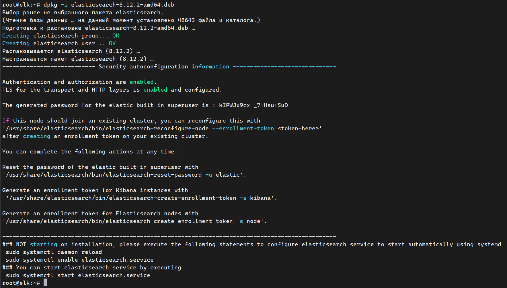
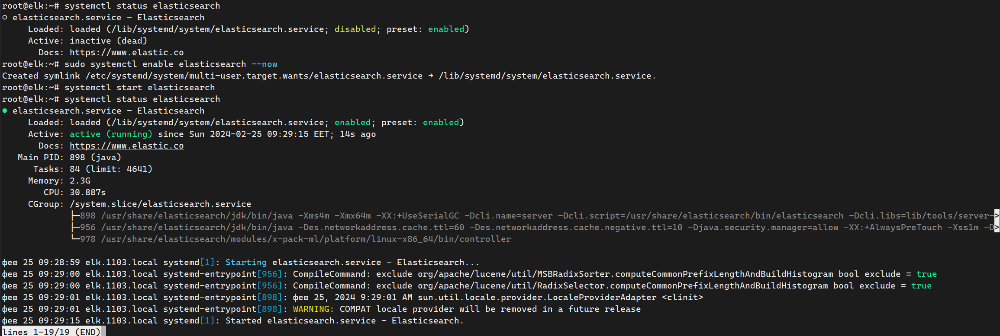
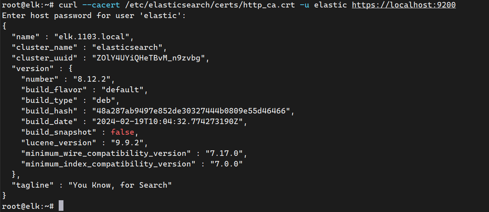

# How_to_Install_Elasticsearch_on_Debian_12

# Установка Elasticsearch на Debian 12

<details>
  <summary>

### Первоначальная подготовка

_целевая ВМ с ОС Debian 12_

  </summary>

меняем / устанавливаем hostname

```
hostnamectl set-hostnmae elk.1103.local
```

обновляем запись DNS, вносим запись 'ip hostanme' в файл /etc/hosts, если нет своего DNS сервера

```
echo "192.168.77.114  elk.1103.local  elk" >> /etc/hosts
```

_,где ip адрес получаем из назначенного на интерфейсе, 'ip a'_


### Установка JRE/JDK

_Open JDK 11 по умолчанию поставляется с Debian._

Обновляем индекс пакетов командой ниже

```
sudo apt update
```

Устанавливаем Java Runtime Environment (JRE)

```
sudo apt install default-jre
```


В качестве альтернативы, можно использовать Liberica JDK

Проверяем версию Java, что бы убедиться, что установка прошла успешно

```
java --version
```



</details>

---

<details>
  <summary>

## Установка Elasticsearch

  </summary>

Устанавливаем GPG ключ elasticsearch

```
wget -qO - https://artifacts.elastic.co/GPG-KEY-elasticsearch | sudo gpg --dearmor -o /usr/share/keyrings/elasticsearch-keyring.gpg
```

Если есть проблемы с доступом к репозиторию Elasticsearch , то можно установить с зеркала

```
wget -qO - https://mirror.g-soft.info/elasticsearch/GPG-KEY-elasticsearch | sudo gpg --dearmor -o /usr/share/keyrings/elasticsearch-keyring.gpg
```

Скачиваем DEB пакет Elasticsearch 8.6 с репозитория elastic

```
wget https://artifacts.elastic.co/downloads/elasticsearch/elasticsearch-8.12.2-amd64.deb
```

Либо скачиваем DEB пакет Elasticsearch 8.6 с зеркала репозитория elastic

```
wget https://mirror.g-soft.info/elasticsearch/elasticsearch-8.12.2-amd64.deb
```

Устанавливаем командой ниже

```
sudo dpkg -i elasticsearch-8.12.2-amd64.deb
```



Запуск и проверка работы службы Elasticsearch

Добавляем в автоматический запуск и запускаем elastic следующей командой

```
sudo systemctl enable elasticsearch --now
```

Проверяем состояние службы

```
systemctl status elasticsearch
```



_если по каким-либо причинам не получили пароль пользователя elastic при установке_

сбрасываем пароль пользователя elastic

```
sudo /usr/share/elasticsearch/bin/elasticsearch-reset-password -u elastic
```

проверяем доступ к API, используя пароль полученный выше

```
curl --cacert /etc/elasticsearch/certs/http_ca.crt -u elastic https://localhost:9200
```

Должны получить ответ, аналогичный приведенному ниже

```
root@elk:~# curl --cacert /etc/elasticsearch/certs/http_ca.crt -u elastic https://localhost:9200
Enter host password for user 'elastic':
{
  "name" : "elk.1103.local",
  "cluster_name" : "elasticsearch",
  "cluster_uuid" : "ZOlY4UYiQHeTBvM_n9zvbg",
  "version" : {
    "number" : "8.12.2",
    "build_flavor" : "default",
    "build_type" : "deb",
    "build_hash" : "48a287ab9497e852de30327444b0809e55d46466",
    "build_date" : "2024-02-19T10:04:32.774273190Z",
    "build_snapshot" : false,
    "lucene_version" : "9.9.2",
    "minimum_wire_compatibility_version" : "7.17.0",
    "minimum_index_compatibility_version" : "7.0.0"
  },
  "tagline" : "You Know, for Search"
}
```


</details>

<!--

<details>
  <summary>


## Настройка Elasticsearch

  </summary>

Конфигурационный файл elasticsearch.yml

```
nano /etc/elasticsearch/elasticsearch.yml 
```

Search for the line that contains network.host, uncomment it, and change the value to 0.0.0.0.

Set the network host to 0.0.0.0 to listen on all interfaces and make it available publicly,

```
network.host: 0.0.0.0
```

In case you want to configure this to be private/local to your machine. You will have to set the network.host to 127.0.0.1, so the content is not public.

Add discovery.type: single-node under the discovery section,

```
discovery.type: single-node
```

Save and exit the file once modified and restart the Elasticsearch service for the changes to take effect.

```
systemctl restart elasticsearch
```
-->

---

